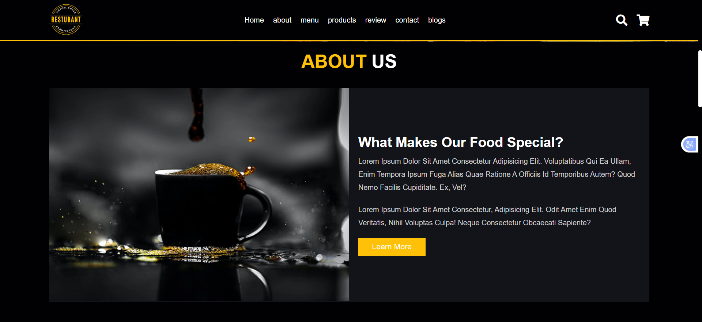
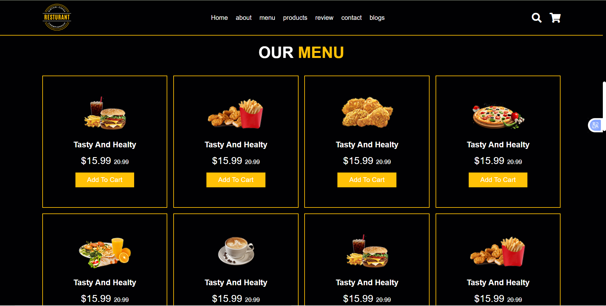
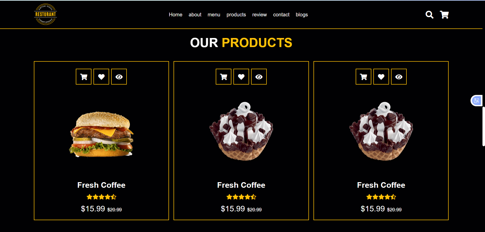
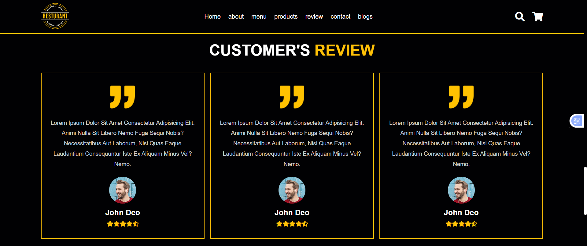
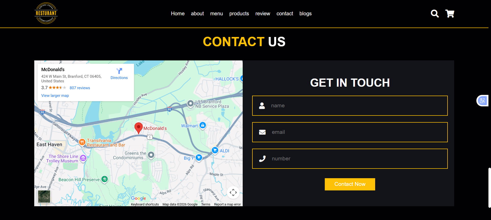
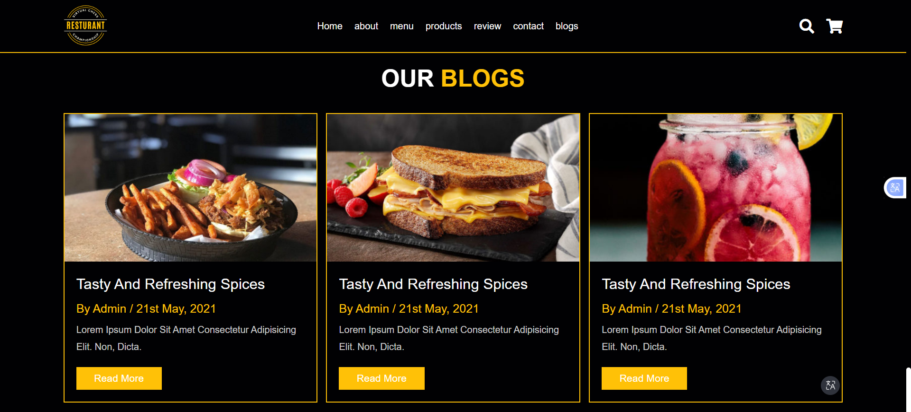
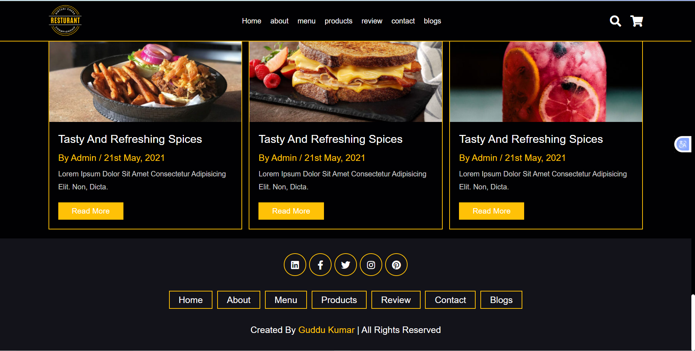

<h1 align="center">🍽️ TasteVista – Restaurant Website</h1>

<p align="center">
A modern and responsive restaurant web application built with React, designed to showcase menus, services, and a smooth user experience.
</p>

---

## 🌐 Live Demo

🔗 https://tastevista.netlify.app/

---

## 📂 GitHub Repository

🐙 https://github.com/KrGuddu/restaurant-app

---

## 📸 Screenshots

### Home Page


### About Page


### Menu Page


### Products Page


### Review Page


### Contact Page


### Blog Page


### Footer Page


---

## 🧾 About This Project

TasteVista is a modern React-based restaurant website focused on clean design, performance, and usability.  
The application presents restaurant details, food menus, and service information through a visually appealing and responsive user interface.

This project demonstrates strong frontend development practices, including component-based architecture, reusable UI components, and responsive design, making it suitable for portfolios and frontend developer interviews.

---

## ✨ Features

- 🍕 Interactive food menu display
- 🧾 Restaurant information & services
- 📱 Fully responsive layout (mobile, tablet, desktop)
- 🎨 Clean and modern UI design
- ⚡ Smooth navigation and fast performance
- 🧩 Reusable React components

---

## 🛠️ Tech Stack

- React  
- JavaScript (ES6+)  
- HTML5  
- CSS3  
- Netlify (Deployment)

---

## ▶️ Run This Project Locally

```bash
# Clone the repository
git clone https://github.com/KrGuddu/restaurant-app.git

# Navigate to the project directory
cd restaurant-app

# Install dependencies
npm install

# Start the development server
npm start

```

## 👨‍💻 Author
**Mr. Guddu Kumar**  
Frontend / React Developer

🌐 Portfolio: https://guddudev.netlify.app

🐙 GitHub: https://github.com/KrGuddu
